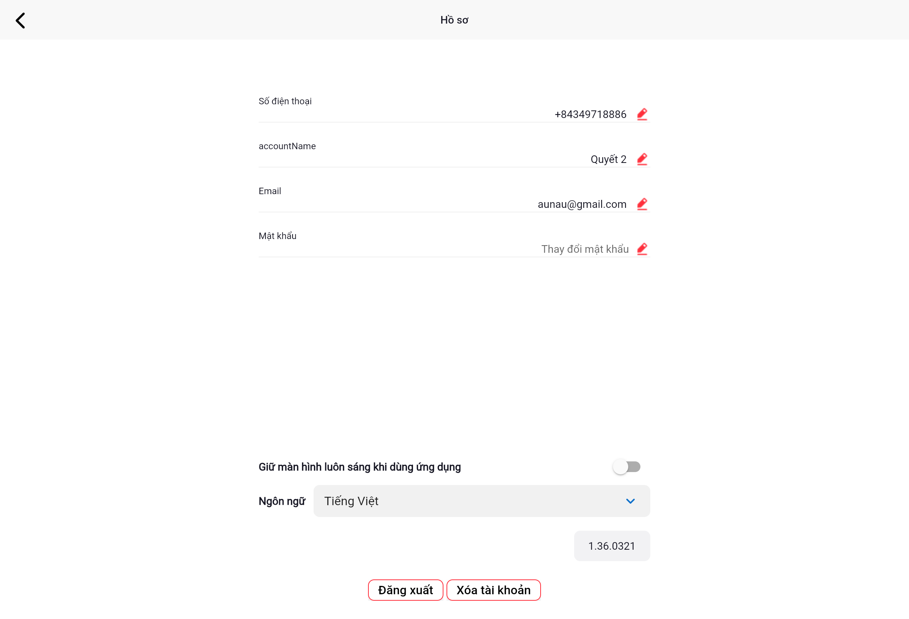
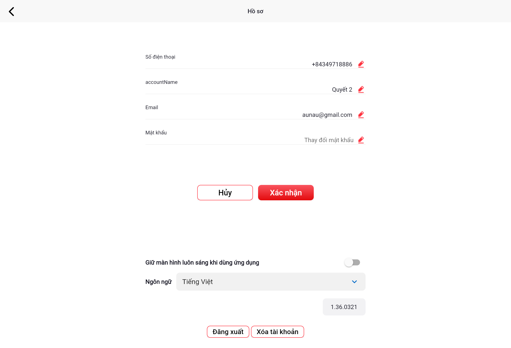

# Xem và chỉnh sửa hồ sơ

Màn hình **Hồ sơ** chứa thông tin tài khoản cá nhân và các cài đặt cơ bản của người dùng.

## Truy cập Hồ sơ

Nhấn vào **tên tài khoản** ở góc trên trái màn hình Tổng quan để vào trang Hồ sơ.

## Thông tin hiển thị

| Trường | Nội dung |
|--------|---------|
| **Số điện thoại** | Số điện thoại đăng ký (không thể thay đổi) |
| **accountName** | Tên hiển thị của tài khoản |
| **Email** | Địa chỉ email liên kết |
| **Mật khẩu** | Nhấn **Thay đổi mật khẩu** để đổi mật khẩu |

## Chỉnh sửa tên tài khoản

1. Nhấn biểu tượng **✏️ (bút)** bên cạnh trường **accountName**
2. Xóa tên cũ và nhập tên mới
3. Nhấn **Xác nhận** để lưu

## Cài đặt khác

- **Giữ màn hình luôn sáng khi dùng ứng dụng**: Bật/tắt tính năng giữ màn hình sáng
- **Ngôn ngữ**: Chọn ngôn ngữ hiển thị của ứng dụng

## Đăng xuất và Xóa tài khoản

- Nhấn **Đăng xuất** để thoát khỏi tài khoản
- Nhấn **Xóa tài khoản** để xóa tài khoản (cần xác nhận)

---

Tiếp theo: [Thay đổi mật khẩu](mat-khau.md)
