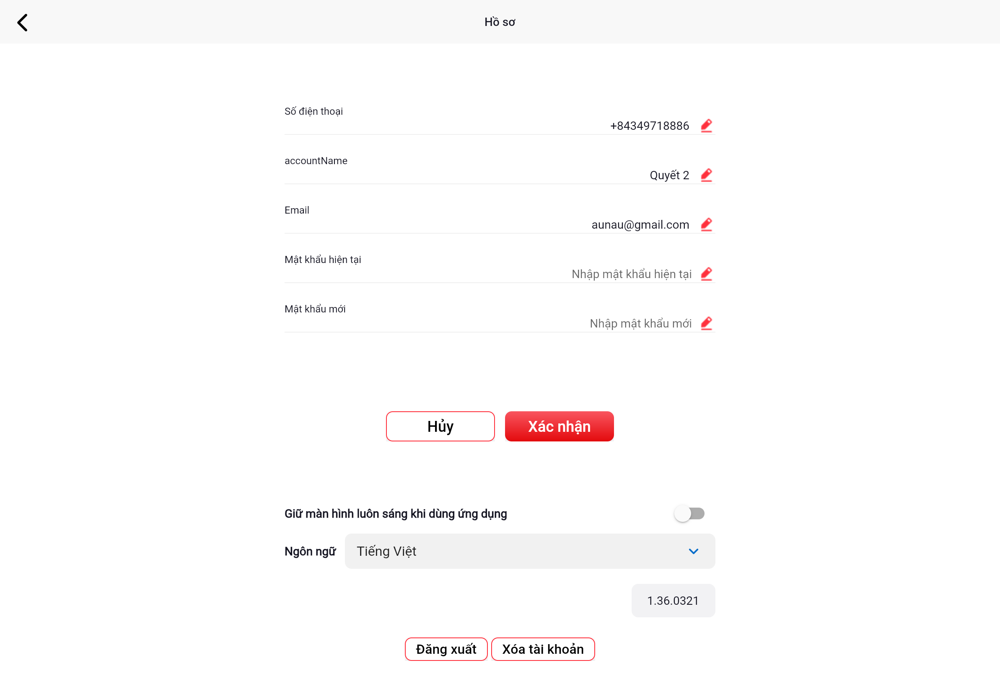

# Thay đổi mật khẩu

## Các bước thực hiện

1. Từ màn hình **Hồ sơ**, nhấn **Thay đổi mật khẩu** ở dòng Mật khẩu
2. Màn hình sẽ hiện thêm hai trường nhập:

| Trường | Nội dung |
|--------|---------|
| **Mật khẩu hiện tại** | Nhập mật khẩu đang dùng |
| **Mật khẩu mới** | Nhập mật khẩu mới muốn đặt |

3. Nhấn **Xác nhận** để lưu mật khẩu mới
4. Nhấn **Hủy** để hủy thao tác

> ⚠️ Mật khẩu mới phải có ít nhất 8 ký tự.

---

Tiếp theo: [Đổi ngôn ngữ](ngon-ngu.md)
