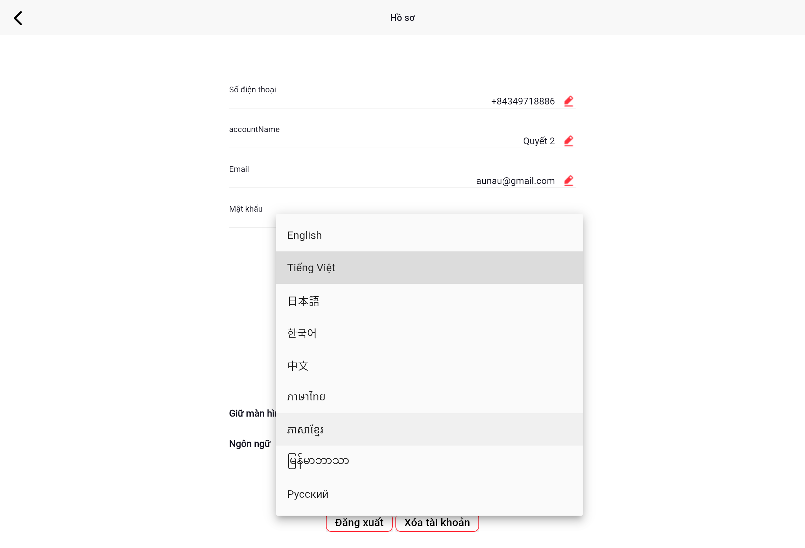

# Đổi ngôn ngữ

Mmenu Admin hỗ trợ nhiều ngôn ngữ. Bạn có thể thay đổi ngôn ngữ hiển thị bất kỳ lúc nào từ màn hình Hồ sơ.

## Các bước thực hiện

1. Từ màn hình **Hồ sơ**, nhấn vào **dropdown Ngôn ngữ**
2. Danh sách ngôn ngữ hiện ra:

| Ngôn ngữ | Hiển thị |
|----------|---------|
| English | Tiếng Anh |
| Tiếng Việt | Tiếng Việt |
| 日本語 | Tiếng Nhật |
| 한국어 | Tiếng Hàn |
| 中文 | Tiếng Trung |
| ภาษาไทย | Tiếng Thái |
| ភាសាខ្មែរ | Tiếng Khmer |
| ພາສາລາວ | Tiếng Lào |
| Русский | Tiếng Nga |

3. Nhấn vào ngôn ngữ muốn chọn — ứng dụng sẽ **đổi ngôn ngữ ngay lập tức**

> 💡 Ngôn ngữ được lưu theo tài khoản. Khi đăng nhập trên thiết bị khác, ngôn ngữ vẫn giữ nguyên.
