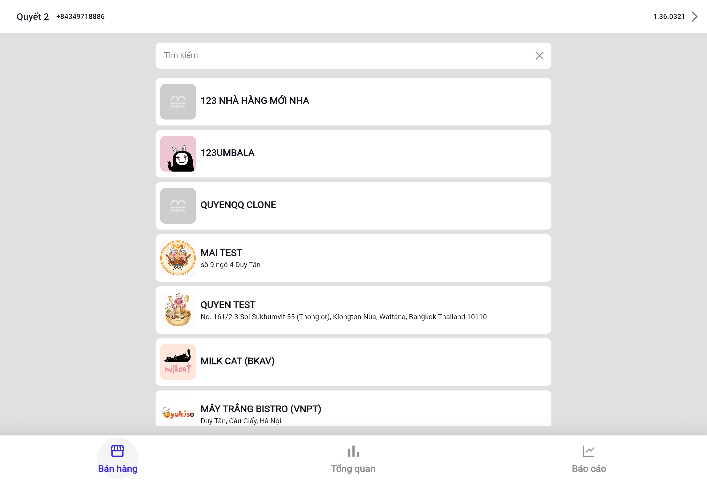
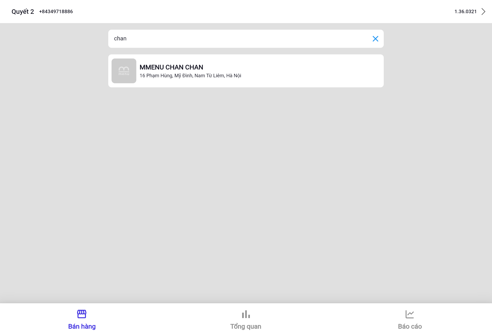

# Chuyển đổi giữa các cửa hàng

Từ màn hình Tổng quan chuỗi, bạn có thể chuyển sang quản lý trực tiếp một cửa hàng cụ thể qua tab **Bán hàng**.

## Tab Bán hàng

Nhấn vào tab **Bán hàng** ở thanh điều hướng dưới cùng để xem danh sách toàn bộ cửa hàng:

Danh sách hiển thị tên và địa chỉ từng cửa hàng trong chuỗi.

## Tìm kiếm cửa hàng

Nhấn vào ô **Tìm kiếm** ở trên cùng, gõ tên cửa hàng để lọc nhanh:

## Vào màn hình quản lý cửa hàng

Nhấn vào tên cửa hàng trong danh sách để vào **màn hình chính** của cửa hàng đó với đầy đủ 15 module chức năng.

> 💡 Để quay lại màn hình Tổng quan chuỗi từ bên trong cửa hàng, nhấn vào **nút mũi tên ← (Back)** ở góc trên trái.

---

Tiếp theo: [Tổng quan QL Order](../ql-order/tong-quan.md)
